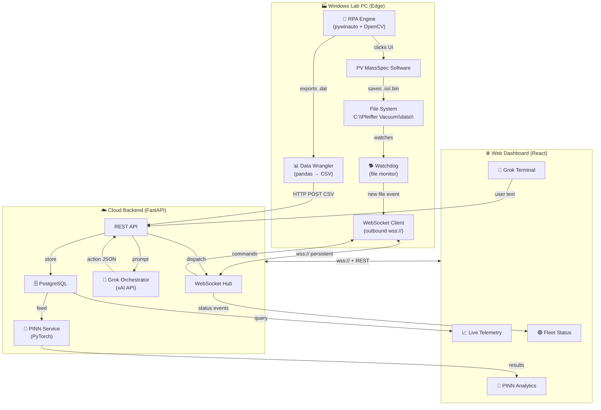

# Cloud-Native LLM-Driven RPA for PrismaPro Mass Spectrometer

Build a cloud-brain + edge-hands system where a web dashboard (accessible from any browser) commands a Windows Host Agent to automate PV MassSpec via a Grok (xAI) LLM orchestrator, with PostgreSQL storage and real-time WebSocket telemetry.

---

## User Review Required

> [!IMPORTANT]
> **Grok API Key**: You will need an xAI API key (`XAI_API_KEY`). The Grok API uses an OpenAI-compatible SDK format at `https://api.x.ai/v1`. Do you already have this key?

> [!IMPORTANT]
> **Deployment Target**: The cloud backend can run on:
> - **(A) Local machine** (your Mac) for development — the Host Agent connects to `ws://192.168.x.x:8000`
> - **(B) A cloud VPS** (e.g., Railway, Render, DigitalOcean) for production — the Host Agent connects to `wss://your-domain.com`
>
> We'll build it to work in **both modes** — local-first for development, cloud-ready for production. Confirm this approach works for your team.

> [!WARNING]
> **PV MassSpec UI Automation (Step 2)**: The RPA engine requires calibration against the real PV MassSpec running on Windows. We'll build a `discover_ui` utility that dumps the full UI control tree so you can identify the exact button names. The RPA code will be structurally complete but the `pywinauto` control paths need one-time calibration on the lab PC.

---

## Open Questions

1. **PINN Model**: Do you have a trained PyTorch PINN model already, or should we include a basic training pipeline from your [PINN_Training_Data.csv](file:///Users/mi/Desktop/KTH%20internship/100PPMCH4/PINN_Training_Data.csv)?
2. **Authentication**: Should the web dashboard have user login (username/password), or is it sufficient to protect it with a shared API key for now?
3. **PostgreSQL**: Should we use a local SQLite for development (auto-switching to PostgreSQL in production), or go PostgreSQL-only from the start?

---

## Architecture Overview



**Key design decision**: The Windows Host Agent connects **outbound** to the cloud server (not the other way around). This means the lab PC doesn't need any open inbound ports or firewall rules — it initiates the connection like a browser would.

---

## Proposed Changes

All code lives under: `/Users/mi/Desktop/KTH internship/rpa-massspec/`

---

### Component 1: Host Agent (Windows Edge — Python)

**Directory**: `rpa-massspec/host-agent/`

The headless daemon on the lab PC. Connects outbound to the cloud, watches for new data files, and executes RPA commands on demand.

#### [NEW] [requirements.txt](file:///Users/mi/Desktop/KTH%20internship/rpa-massspec/host-agent/requirements.txt)
- `websockets>=12.0` — persistent WSS client
- `watchdog>=4.0` — file system monitoring
- `pywinauto>=0.6.8` — Windows UI automation (Windows-only)
- `pyautogui>=0.9` — pixel-based click fallback (Windows-only)
- `opencv-python>=4.8` — template matching fallback (Windows-only)
- `pandas>=2.0` — data wrangling
- `numpy>=1.24` — numerical operations
- `httpx>=0.27` — async HTTP client for CSV upload
- `python-dotenv>=1.0` — environment config
- `Pillow>=10.0` — screenshot capture on failure

#### [NEW] [config.py](file:///Users/mi/Desktop/KTH%20internship/rpa-massspec/host-agent/config.py)
- `CLOUD_WS_URL` — WebSocket endpoint to connect to (e.g., `ws://localhost:8000/ws/agent` or `wss://prod.example.com/ws/agent`)
- `CLOUD_API_URL` — REST endpoint for CSV upload (e.g., `http://localhost:8000/api`)
- `MACHINE_ID` — unique identifier for this lab PC (e.g., `PrismaPro_01`)
- `MACHINE_SECRET` — authentication token for this agent
- `WATCH_DIRECTORY` — path to monitor (default: `C:\Pfeiffer Vacuum\data\`)
- `WATCH_EXTENSIONS` — file types to track: `.isi`, `.bin`
- `EXPORT_OUTPUT_DIR` — where exported `.dat` files are saved
- `RECONNECT_INTERVAL` — seconds between reconnection attempts (default: 5)
- `HEARTBEAT_INTERVAL` — seconds between keepalive pings (default: 10)

#### [NEW] [watchdog_service.py](file:///Users/mi/Desktop/KTH%20internship/rpa-massspec/host-agent/watchdog_service.py)
- `RunFileHandler(FileSystemEventHandler)`:
  - Overrides `on_created()` to catch new `.isi` and `.bin` files
  - **File stability check**: polls file size at 500ms intervals until stable (prevents catching mid-write files)
  - **Filename parser**: extracts gas name, concentration, instrument ID, and timestamp from PV MassSpec naming convention (e.g., `"100PPMCH4-TR1, Position 1, RGA PrismaPro A 200 47505932, 002-11-2025 16'54'02.isi"`)
  - **Debounce**: ignores duplicate events within a 2-second window (OS often fires multiple events per file)
  - Emits structured event to the WebSocket client queue
- `start_watching(directory, callback)`: Creates and starts the `Observer`

#### [NEW] [rpa_engine.py](file:///Users/mi/Desktop/KTH%20internship/rpa-massspec/host-agent/rpa_engine.py)
- `RPAEngine` class with these methods:
  - `connect_to_pvmassspec()` — `pywinauto.Application().connect(path="PVMassSpec.exe")`, brings window to foreground
  - `discover_ui_tree()` → returns full `print_control_identifiers()` output as JSON (for remote calibration)
  - `export_to_ascii(isi_filepath)` — opens the file in PV MassSpec, navigates menus, clicks "Export to ASCII", handles save dialog, returns `.dat` path
  - `export_date_range(start_date, end_date, target_gas)` — navigates date picker, filters, batch exports
  - `run_calibration()` — triggers PV MassSpec calibration routine
  - `shutdown_acquisition()` — graceful stop
- **OpenCV fallback** (`_find_and_click_template(template_path)`):
  - Captures screenshot via `pyautogui.screenshot()`
  - Loads reference template from `templates/` directory
  - `cv2.matchTemplate()` with `TM_CCOEFF_NORMED`, threshold > 0.8
  - Calculates center point of match region, performs `pyautogui.click()`
- **Safety layer**:
  - Every action wrapped in `try/except` with automatic screenshot on failure (saved to `logs/screenshots/`)
  - Action timeout: 30 seconds max per UI operation
  - Lock mechanism: only one RPA action at a time

#### [NEW] [data_wrangler.py](file:///Users/mi/Desktop/KTH%20internship/rpa-massspec/host-agent/data_wrangler.py)
- Evolved from your existing [DatToCsv.py](file:///Users/mi/Desktop/KTH%20internship/DatToCsv.py):
  - `parse_dat_file(filepath)` — reads `.dat` with tab separator, skips 8-line header
  - **Auto-column detection**: scans header row for `*_amu_*` columns instead of hardcoding mass channels
  - **Filename metadata extraction**: parses concentration (regex: `(\d+)PPM` or `(\d+)%`) and gas name from the filepath
  - `melt_to_pinn_format(df)` — pivots wide columns to long format matching your schema:
    ```
    Time Relative (sec), Pressure_(mBar), Raw_Signal_Amps, mz, True_Concentration_ppm, Primary_Gas
    ```
  - `upload_to_cloud(csv_data, run_metadata)` — async HTTP POST to cloud backend API

#### [NEW] [ws_client.py](file:///Users/mi/Desktop/KTH%20internship/rpa-massspec/host-agent/ws_client.py)
- `AgentWSClient` class:
  - **Auto-reconnect loop**: connects to `CLOUD_WS_URL`, on disconnect waits `RECONNECT_INTERVAL` seconds and retries indefinitely
  - **Authentication handshake**: on connect, sends `{"type": "auth", "machine_id": "...", "secret": "..."}`
  - **Heartbeat**: sends `{"type": "heartbeat"}` every `HEARTBEAT_INTERVAL` seconds
  - **Inbound message router**: dispatches received commands to the RPA engine:
    ```python
    handlers = {
        "export_latest_run": rpa.export_to_ascii,
        "export_date_range": rpa.export_date_range,
        "run_calibration": rpa.run_calibration,
        "discover_ui": rpa.discover_ui_tree,
        "shutdown": rpa.shutdown_acquisition,
    }
    ```
  - **Outbound event queue**: watchdog events and RPA results are queued and sent over the WebSocket
  - **Status reporting**: sends agent status (`idle`, `busy`, `error`) after every action

#### [NEW] [main.py](file:///Users/mi/Desktop/KTH%20internship/rpa-massspec/host-agent/main.py)
- Entry point: `asyncio.run(main())`
- Starts three concurrent tasks:
  1. Watchdog file observer (in a thread via `loop.run_in_executor`)
  2. WebSocket client (async)
  3. Signal handler for graceful shutdown (SIGINT/SIGTERM, or Windows `CTRL_C_EVENT`)
- Logging to both console and rotating file (`logs/agent.log`)

---

### Component 2: Cloud Backend (FastAPI + PostgreSQL)

**Directory**: `rpa-massspec/cloud-backend/`

The central brain — handles web API, Grok LLM integration, WebSocket hub for agents and browsers, data storage, and PINN inference.

#### [NEW] [requirements.txt](file:///Users/mi/Desktop/KTH%20internship/rpa-massspec/cloud-backend/requirements.txt)
- `fastapi>=0.111` — web framework
- `uvicorn[standard]>=0.30` — ASGI server
- `websockets>=12.0` — WebSocket support
- `openai>=1.30` — xAI Grok uses OpenAI-compatible API
- `sqlalchemy>=2.0` — ORM
- `asyncpg>=0.29` — async PostgreSQL driver
- `aiosqlite>=0.20` — async SQLite for development
- `alembic>=1.13` — database migrations
- `python-dotenv>=1.0` — env config
- `pandas>=2.0` — data processing
- `numpy>=1.24` — numerical
- `pydantic>=2.0` — data validation
- `python-jose>=3.3` — JWT token handling
- `passlib>=1.7` — password hashing
- `torch>=2.0` — PINN inference (optional, can be CPU-only)

#### [NEW] [config.py](file:///Users/mi/Desktop/KTH%20internship/rpa-massspec/cloud-backend/config.py)
- Environment-driven configuration:
  - `DATABASE_URL` — `sqlite+aiosqlite:///./dev.db` (dev) or `postgresql+asyncpg://...` (prod)
  - `XAI_API_KEY` — Grok API authentication
  - `XAI_BASE_URL` — `https://api.x.ai/v1`
  - `XAI_MODEL` — `grok-3` (or `grok-3-mini` for cost savings)
  - `AGENT_SECRET` — shared secret for Host Agent authentication
  - `JWT_SECRET` — for web dashboard user sessions
  - `CORS_ORIGINS` — allowed frontend origins

#### [NEW] [models.py](file:///Users/mi/Desktop/KTH%20internship/rpa-massspec/cloud-backend/models.py)
- SQLAlchemy ORM models:
  ```
  Agent: id, machine_id, name, status (online/offline/busy), last_heartbeat, created_at
  Run: id, agent_id, filepath, gas_name, concentration_ppm, timestamp, status (detected/processing/complete/error)
  Measurement: id, run_id, time_relative_sec, pressure_mbar, raw_signal_amps, mz
  PINNResult: id, run_id, machine_constant_k, predicted_concentration_ppm, confidence, matrix_effects_json
  ChatMessage: id, session_id, role (user/assistant/system), content, action_json, created_at
  ```

#### [NEW] [database.py](file:///Users/mi/Desktop/KTH%20internship/rpa-massspec/cloud-backend/database.py)
- Async SQLAlchemy engine and session factory
- Auto-creates tables on startup (dev mode) or uses Alembic migrations (prod)

#### [NEW] [grok_service.py](file:///Users/mi/Desktop/KTH%20internship/rpa-massspec/cloud-backend/grok_service.py)
- `GrokOrchestrator` class:
  - Initializes OpenAI client with xAI base URL:
    ```python
    self.client = AsyncOpenAI(api_key=XAI_API_KEY, base_url="https://api.x.ai/v1")
    ```
  - **System prompt** (strictly bounded):
    ```
    You are a laboratory RPA orchestrator for a Pfeiffer Vacuum PrismaPro mass spectrometer.
    
    CONTEXT:
    - You control the instrument remotely via a Windows agent
    - The data directory contains runs organized by date folders
    - Files are named: "{gas}-{trial}, Position {n}, RGA PrismaPro A 200 {serial}, {date}.isi"
    - Available gases: Methane (CH4), Water (H2O), Nitrogen (N2), Oxygen (O2), CO2
    - Today's date is: {dynamic_date}
    
    ALLOWED ACTIONS (you must respond with exactly one):
    - export_latest_run: Export the most recent measurement. Params: {}
    - export_date_range: Export runs in a date range. Params: {start_date: "YYYY-MM-DD", end_date: "YYYY-MM-DD", target_gas?: "string"}
    - run_calibration: Trigger calibration. Params: {}
    - shutdown: Stop acquisition. Params: {}
    - query_status: Check agent status. Params: {}
    
    RESPONSE FORMAT (strict JSON, no markdown):
    {"action": "action_name", "params": {...}, "explanation": "Brief human-readable explanation"}
    
    If the user's request doesn't match any action, respond with:
    {"action": "none", "params": {}, "explanation": "Why you can't fulfill this request"}
    ```
  - `process_message(user_text, chat_history)` → returns parsed action JSON
  - **Validation**: output is parsed and validated against the action schema before dispatch
  - **Retry logic**: 3 attempts with exponential backoff on API errors

#### [NEW] [ws_hub.py](file:///Users/mi/Desktop/KTH%20internship/rpa-massspec/cloud-backend/ws_hub.py)
- `ConnectionManager` class managing two pools:
  - **Agent connections**: `Dict[machine_id, WebSocket]` — one per lab PC
  - **Browser connections**: `Set[WebSocket]` — multiple dashboard viewers
- Methods:
  - `register_agent(ws, machine_id)` — adds to agent pool, sets status "online"
  - `unregister_agent(machine_id)` — removes, sets status "offline"
  - `dispatch_to_agent(machine_id, command)` — sends command JSON to specific agent
  - `broadcast_to_browsers(event)` — fans out events to all connected dashboards
  - `handle_agent_message(machine_id, message)` — processes agent events (new run, export complete, status)
  - `handle_browser_message(ws, message)` — processes dashboard chat messages

#### [NEW] [routes/api.py](file:///Users/mi/Desktop/KTH%20internship/rpa-massspec/cloud-backend/routes/api.py)
- REST endpoints:
  - `POST /api/chat` — accepts `{"message": "text"}`, calls Grok, returns action + dispatches to agent
  - `GET /api/runs` — paginated list of all detected runs with status
  - `GET /api/runs/{run_id}` — full measurement data for a run
  - `GET /api/runs/{run_id}/telemetry` — time-series data for charting
  - `POST /api/runs/upload` — Host Agent POSTs processed CSV data here
  - `GET /api/agents` — list all registered agents with status
  - `GET /api/pinn/{run_id}` — PINN inference results
  - `POST /api/pinn/{run_id}/run` — trigger PINN inference on a run
  - `GET /api/actions/schema` — returns allowed action definitions (for UI auto-complete)

#### [NEW] [routes/ws.py](file:///Users/mi/Desktop/KTH%20internship/rpa-massspec/cloud-backend/routes/ws.py)
- WebSocket endpoints:
  - `ws://host/ws/agent` — for Host Agent connections (authenticated by `machine_id` + `secret`)
  - `ws://host/ws/dashboard` — for browser dashboard connections (authenticated by JWT)
- Message protocol:
  ```json
  // Agent → Cloud (upstream)
  {"type": "auth", "machine_id": "PrismaPro_01", "secret": "..."}
  {"type": "heartbeat"}
  {"type": "event", "name": "new_run_detected", "data": {"filepath": "...", "gas": "Methane", "concentration": 100, "timestamp": "..."}}
  {"type": "event", "name": "export_complete", "data": {"run_id": "...", "csv_rows": 2337}}
  {"type": "event", "name": "rpa_status", "data": {"status": "idle|busy|error", "action": "...", "detail": "..."}}
  
  // Cloud → Agent (downstream)
  {"type": "command", "action": "export_latest_run", "params": {}, "request_id": "uuid"}
  {"type": "command", "action": "export_date_range", "params": {"start_date": "2026-07-21", "end_date": "2026-07-21", "target_gas": "Methane"}, "request_id": "uuid"}
  
  // Cloud → Browser (downstream)
  {"type": "event", "name": "new_run_detected", "data": {...}}
  {"type": "event", "name": "agent_status_changed", "data": {"machine_id": "...", "status": "online"}}
  {"type": "chat_response", "data": {"action": "...", "explanation": "...", "status": "dispatched"}}
  ```

#### [NEW] [pinn_service.py](file:///Users/mi/Desktop/KTH%20internship/rpa-massspec/cloud-backend/pinn_service.py)
- Loads a pre-trained PyTorch PINN model (or provides a stub if no model exists yet)
- `run_inference(run_id)`:
  - Fetches measurement data from DB
  - Preprocesses: normalizes `Raw_Signal_Amps`, encodes `mz`
  - Runs forward pass through PINN
  - Returns: `machine_constant_k`, `predicted_concentration_ppm`, `matrix_effects`, `confidence`
- Stores results in `PINNResult` table

#### [NEW] [main.py](file:///Users/mi/Desktop/KTH%20internship/rpa-massspec/cloud-backend/main.py)
- FastAPI app initialization with:
  - CORS middleware (configured for frontend origin)
  - Lifespan handler: creates DB tables on startup, closes connections on shutdown
  - Mounts REST routes and WebSocket endpoints
  - `uvicorn.run(app, host="0.0.0.0", port=8000)`

---

### Component 3: Web Dashboard (React + Vite)

**Directory**: `rpa-massspec/web-dashboard/`

A premium, dark-themed web application accessible from any browser. No desktop app needed.

#### [NEW] Vite + React + TypeScript scaffold
- Initialize with `npx -y create-vite@latest ./ --template react-ts`
- Additional deps: `recharts`, `zustand`, `lucide-react`, `framer-motion`

#### [NEW] Design System (`src/index.css`)
- **Dark mode** with glassmorphism aesthetic:
  - Background: `hsl(222, 47%, 6%)` (deep navy)
  - Surface: `hsl(222, 30%, 10%)` with `backdrop-filter: blur(12px)` and `border: 1px solid rgba(255,255,255,0.06)`
  - Primary accent: `hsl(210, 100%, 60%)` (electric blue)
  - Success: `hsl(145, 80%, 50%)` (neon green)
  - Warning: `hsl(38, 95%, 55%)` (amber)
  - Error: `hsl(0, 85%, 60%)` (soft red)
  - Text: `hsl(220, 15%, 85%)` on dark
- **Typography**: Inter (UI) + JetBrains Mono (code/terminal)
- **Animations**: Framer Motion for panel transitions, CSS `@keyframes` for status pulses

#### [NEW] Layout (`src/App.tsx`)
- 2×2 responsive grid layout:
  ```
  ┌─────────────────────┬──────────────────────┐
  │                     │                      │
  │   Grok Terminal     │   Live Telemetry     │
  │   (Chat Panel)      │   (Line Charts)      │
  │                     │                      │
  ├─────────────────────┼──────────────────────┤
  │                     │                      │
  │   Fleet Status      │   PINN Analytics     │
  │   (Agent Monitor)   │   (Results Panel)    │
  │                     │                      │
  └─────────────────────┴──────────────────────┘
  ```
- Collapses to single column on mobile/tablet

#### [NEW] `src/components/ChatPanel.tsx`
- Terminal-style interface with:
  - Scrollable message history
  - User messages: right-aligned, blue gradient bubble
  - Grok responses: left-aligned, purple/indigo gradient with syntax-highlighted JSON
  - System events: center-aligned, muted with icon (e.g., "🟢 New run detected: Methane 100ppm")
  - Input bar: dark glass input with glowing border on focus, send button with arrow icon
  - Command suggestions: autocomplete dropdown with allowed actions
  - Typing indicator: animated dots when waiting for Grok response

#### [NEW] `src/components/TelemetryPanel.tsx`
- Recharts `LineChart` with:
  - X-axis: `Time Relative (sec)`
  - Y-axis: `Raw_Signal_Amps` (scientific notation formatter)
  - Multi-line: one trace per mass channel (m/z 16, 18, 28, 32, 44)
  - Color map: Methane=cyan, Water=blue, Nitrogen=purple, Oxygen=green, CO2=orange
  - Interactive: crosshair tooltip showing values for all channels
  - Zoomable via brush/scroll
  - Run selector dropdown to switch between datasets
  - Auto-updates when new data arrives via WebSocket

#### [NEW] `src/components/StatusPanel.tsx`
- Each registered agent shown as a card:
  - Machine ID + friendly name
  - Status indicator:
    - 🟢 Pulsing green dot + "Online — Idle"
    - 🟡 Spinning amber dot + "Executing: Export to ASCII..."
    - 🔴 Static red dot + "Offline — Last seen 5m ago"
  - Last heartbeat timestamp
  - Latency indicator (ping time from last heartbeat)
  - Connection uptime counter

#### [NEW] `src/components/PINNPanel.tsx`
- Results card showing:
  - **Machine Constant** ($k$): large numeric display with unit
  - **Predicted Concentration**: value ± confidence interval
  - **Matrix Effects**: horizontal bar chart showing interference contributions from each gas
  - **Run selector**: dropdown to pick which run's results to display
  - **"Run Inference" button**: triggers PINN on the selected run, shows loading spinner

#### [NEW] `src/services/api.ts`
- Axios/fetch wrapper for REST endpoints:
  - `postChat(message)` → `POST /api/chat`
  - `getRuns()` → `GET /api/runs`
  - `getRunTelemetry(runId)` → `GET /api/runs/{id}/telemetry`
  - `getAgents()` → `GET /api/agents`
  - `runPINN(runId)` → `POST /api/pinn/{id}/run`
  - `getPINNResult(runId)` → `GET /api/pinn/{id}`

#### [NEW] `src/services/websocket.ts`
- `DashboardWebSocket` class:
  - Connects to `ws://backend/ws/dashboard`
  - Auto-reconnect with exponential backoff (1s, 2s, 4s, 8s, max 30s)
  - Event handlers: `onNewRun`, `onAgentStatus`, `onChatResponse`, `onExportComplete`
  - Connection state exposed to Zustand store

#### [NEW] `src/stores/appStore.ts`
- Zustand store with slices:
  - `agents: Agent[]` — fleet status
  - `runs: Run[]` — detected/processed runs
  - `chatMessages: Message[]` — conversation history
  - `telemetryData: Map<runId, DataPoint[]>` — chart data
  - `pinnResults: Map<runId, PINNResult>` — inference results
  - `wsStatus: 'connecting' | 'connected' | 'disconnected'`

---

## Implementation Order (Step-by-Step)

| Phase | What We Build | Files | Testable On |
|-------|--------------|-------|-------------|
| **Phase 1** | Host Agent Core (no RPA) | `config.py`, `watchdog_service.py`, `data_wrangler.py`, `ws_client.py`, `main.py` | ✅ Mac (mock mode using your existing data) |
| **Phase 2** | Cloud Backend Core | `config.py`, `models.py`, `database.py`, `ws_hub.py`, `routes/`, `main.py` | ✅ Mac |
| **Phase 3** | Grok LLM Integration | `grok_service.py` + chat endpoint | ✅ Mac (needs xAI key) |
| **Phase 4** | Web Dashboard | Full React app with all 4 panels | ✅ Mac (any browser) |
| **Phase 5** | RPA Engine | `rpa_engine.py` with pywinauto + OpenCV | ⚠️ Windows only |
| **Phase 6** | PINN Integration | `pinn_service.py` + analytics panel wiring | ✅ Mac |
| **Phase 7** | End-to-End Integration | Full loop testing | Both platforms |

> [!TIP]
> **Phases 1–4 can be fully developed and tested on your Mac.** We'll use your existing [Pfeiffer Vacuum/data/](file:///Users/mi/Desktop/KTH%20internship/Pfeiffer%20Vacuum/data) directory as mock data for the watchdog, and the [100PPMCH4/](file:///Users/mi/Desktop/KTH%20internship/100PPMCH4) sample files for the data wrangler and telemetry charts. The RPA engine (Phase 5) is the only component that requires the actual Windows lab PC.

---

## Verification Plan

### Automated Tests
```bash
# Host Agent tests
cd rpa-massspec/host-agent && python -m pytest tests/ -v

# Cloud Backend tests  
cd rpa-massspec/cloud-backend && python -m pytest tests/ -v
```

- `test_watchdog.py` — create temp `.isi` file → verify event emitted with correct metadata
- `test_data_wrangler.py` — process sample `.dat` → verify output matches [PINN_Training_Data.csv](file:///Users/mi/Desktop/KTH%20internship/100PPMCH4/PINN_Training_Data.csv) schema
- `test_grok_service.py` — mock xAI API → verify prompt formatting + output parsing
- `test_ws_hub.py` — simulate agent connect/disconnect + command dispatch
- `test_api.py` — integration tests for all REST endpoints

### Manual Verification
1. **Phase 1**: Copy a `.isi` file into the watch directory → verify JSON event appears in agent logs
2. **Phase 2**: Start backend → verify health endpoint at `http://localhost:8000/docs` (auto-generated Swagger UI)
3. **Phase 3**: Send chat message → verify Grok returns valid action JSON
4. **Phase 4**: Open dashboard → verify all 4 panels render with mock data, WebSocket connects
5. **Phase 5**: Run `discover_ui` on Windows PC → capture PV MassSpec UI tree for calibration
6. **Phase 7**: Full loop — file appears → dashboard alerts → user commands export → data appears in chart

---

## File Structure Summary

```
rpa-massspec/
├── README.md
├── .env.example
│
├── host-agent/                         # 🏭 Windows Edge Daemon (Python)
│   ├── requirements.txt
│   ├── .env                            # Machine-specific config
│   ├── config.py                       # Configuration constants
│   ├── main.py                         # Entry point (asyncio)
│   ├── watchdog_service.py             # File system monitor
│   ├── rpa_engine.py                   # pywinauto + OpenCV automation
│   ├── data_wrangler.py                # .dat → PINN CSV converter
│   ├── ws_client.py                    # WebSocket client (outbound)
│   ├── templates/                      # OpenCV reference images
│   │   └── export_button.png
│   ├── logs/                           # Runtime logs + failure screenshots
│   └── tests/
│       ├── test_watchdog.py
│       ├── test_data_wrangler.py
│       └── test_ws_client.py
│
├── cloud-backend/                      # ☁️ Central Server (FastAPI)
│   ├── requirements.txt
│   ├── .env                            # API keys, DB URL
│   ├── config.py                       # Environment config
│   ├── main.py                         # FastAPI app entry point
│   ├── models.py                       # SQLAlchemy ORM models
│   ├── database.py                     # DB engine & session
│   ├── grok_service.py                 # xAI Grok LLM integration
│   ├── ws_hub.py                       # WebSocket connection manager
│   ├── pinn_service.py                 # PyTorch PINN inference
│   ├── routes/
│   │   ├── api.py                      # REST endpoints
│   │   └── ws.py                       # WebSocket endpoints
│   └── tests/
│       ├── test_grok_service.py
│       ├── test_ws_hub.py
│       └── test_api.py
│
└── web-dashboard/                      # 🌐 Browser UI (React + Vite)
    ├── package.json
    ├── vite.config.ts
    ├── index.html
    ├── public/
    └── src/
        ├── App.tsx                     # Root layout (2×2 grid)
        ├── index.css                   # Design system + global styles
        ├── main.tsx                    # React entry point
        ├── components/
        │   ├── ChatPanel.tsx           # 💬 Grok Terminal
        │   ├── TelemetryPanel.tsx      # 📈 Live Charts
        │   ├── StatusPanel.tsx         # 🟢 Fleet Monitor
        │   └── PINNPanel.tsx           # 🧮 PINN Analytics
        ├── services/
        │   ├── api.ts                  # REST client
        │   └── websocket.ts           # WebSocket client
        └── stores/
            └── appStore.ts             # Zustand state management
```
